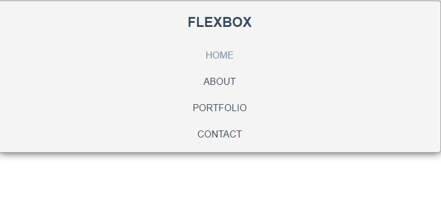

# flexbox navbar

A basic navbar made using flexbox and media query concepts. The navbar changes from horizontal alignment to vertical at the breaking point.

| Property                 | Value                                |
| ------------------------ | ------------------------------------ |
| font-family              | sans-serif                           |
| line-height              | 1.6                                  |
| color (links)            | #34495e                              |
| color (links) on hover   | #718daa                              |
| background color (header) | #f4f4f4                              |
| box-shadow (header)      | 0px 0px 14px 0px rgba(0, 0, 0, 0.75) |
| break point              | 769px                                |